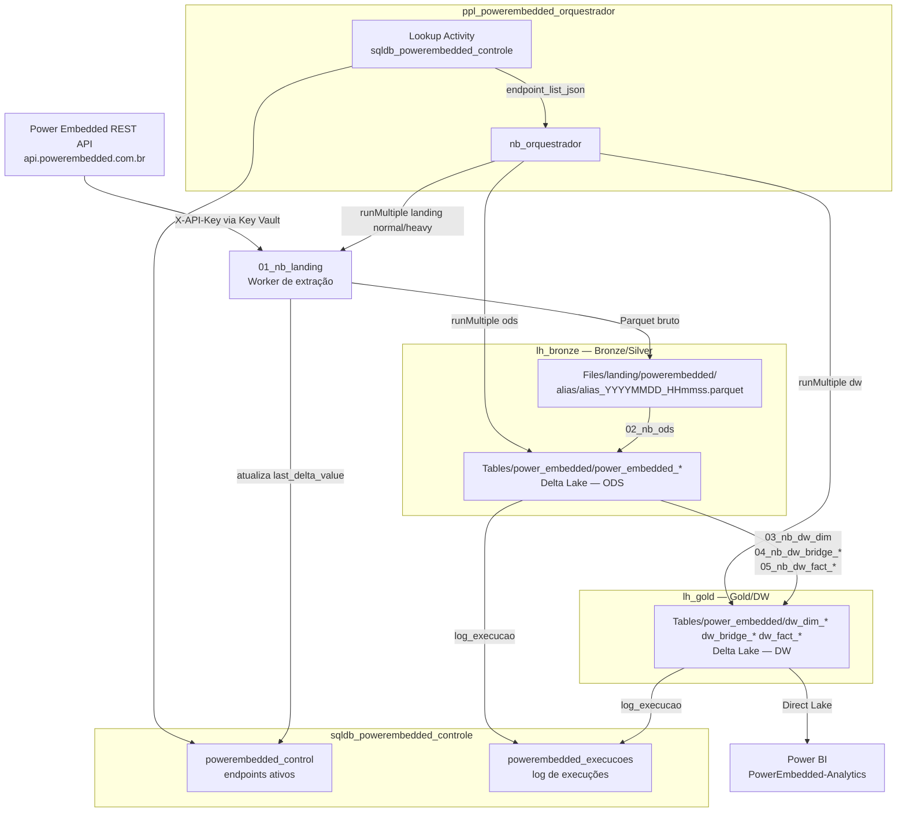

# Arquitetura — Power Embedded / api-embedded

## Visão Geral

O Power Embedded é uma plataforma de distribuição de relatórios Power BI para usuários externos. O problema central: a plataforma não oferece analytics nativo sobre o uso — dados de acesso, permissões, identidade e envio de e-mails ficam presos na API REST, inacessíveis para análise histórica ou relatórios consolidados.

Este pipeline resolve esse problema extraindo os dados da API em ciclos regulares, processando-os em três camadas (Landing, ODS, DW) e disponibilizando-os no Microsoft Fabric para consumo via Power BI com Direct Lake. Landing e ODS residem no `lh_bronze`; a camada DW reside no `lh_gold`.

### Diagrama da arquitetura completa



---

## Workspaces

O projeto usa dois workspaces separados por responsabilidade:

| Workspace | Conteúdo |
|-----------|----------|
| `PowerEmbedded-Engenharia` | Notebooks, Pipeline, Lakehouses, SQL Database |
| `PowerEmbedded-Analytics` | Semantic Models e relatórios Power BI |

---

## Lakehouses

| Lakehouse | Camada | Conteúdo |
|-----------|--------|----------|
| `lh_bronze` | Bronze + Silver | `Files/landing/` (Parquet) + `Tables/power_embedded/power_embedded_*` (Delta ODS) |
| `lh_gold` | Gold | `Tables/power_embedded/dw_dim_*`, `dw_bridge_*`, `dw_fact_*` (Delta DW) |

Os notebooks DW leem da ODS via path ABFSS explícito apontando para o `lh_bronze`. As dimensões usadas em joins dentro dos notebooks de bridge também são lidas via ABFSS apontando para o `lh_gold` — nunca via `spark.table()`, pois esse método depende do lakehouse default configurado no workspace e falha quando o notebook é executado via pipeline.

---

## Camadas de Dados

### Landing (Bronze)

A Landing é a zona de aterrissagem do dado bruto, sem nenhuma transformação aplicada. O objetivo é preservar o snapshot exato do que a API retornou em determinado momento.

**Por que Parquet e não Delta?** Parquet é adequado para dado bruto porque elimina a necessidade de transaction log (overhead desnecessário nessa camada), permite leitura direta por qualquer ferramenta e simplifica a operação de overwrite por execução. ACID não é necessário aqui — a Landing é append de arquivos, não de linhas.

**Como funciona:**
- Um arquivo por execução por endpoint, nomeado `{alias}_{yyyyMMdd_HHmmss}.parquet`
- Armazenado em `lh_bronze/Files/landing/powerembedded/{alias}/`
- Todas as colunas são `StringType` — tipos são inferidos só na camada ODS
- Coluna adicional `dt_extracao` adicionada com timestamp UTC da extração
- Após salvar o novo arquivo, o worker apaga arquivos com mais de 7 dias na mesma pasta (verificação por `mtime` via `notebookutils.fs`)

**Por que todas as colunas como StringType?** A API pode retornar campos com tipo variável entre chamadas ou com arrays e objetos aninhados. Serializar tudo como string na Landing elimina problemas de inferência de tipo do Spark (colunas `VOID`, schemas aninhados vazios que causam `DELTA_FAILED_TO_MERGE_FIELDS`). A tipagem correta acontece na ODS com controle explícito.

---

### ODS — Operational Data Store (Silver)

A ODS é a camada de dados limpos e tipados, prontos para consumo analítico básico e como fonte para a camada DW.

**Localização:** `lh_bronze / Tables / power_embedded / power_embedded_{alias}`

**Transformações aplicadas:**

1. **`flatten_json_columns()`** — expande colunas que contêm JSON objects serializado como string (resultado da Landing). Detecta por amostragem, infere schema via `spark.read.json()` e aplica `from_json` + expansão recursiva de structs. JSON arrays são mantidos como string para tratamento no DW.

2. **`cast_string_columns()`** — infere e casteia colunas escalares para os tipos nativos correspondentes (Boolean, LongType, DoubleType, TimestampType, DateType). A ordem de detecção por amostragem garante que o tipo mais específico possível seja aplicado.

3. **Schema alignment** — para endpoints `incremental_datetime`, antes do append o worker lê o schema já gravado na tabela Delta e casteia o novo DataFrame para bater exatamente com os tipos existentes. Isso evita `DELTA_FAILED_TO_MERGE_FIELDS` em situações onde uma coluna era null na carga inicial (ficou como `StringType`) e na carga seguinte passou a ter valor (cast inferiu `LongType`).

4. **`dt_carga`** — timestamp UTC adicionado no momento da gravação.

**Estratégias de carga:**

| `load_type` | Comportamento | Quando usar |
|-------------|---------------|-------------|
| `full` | Overwrite completo da tabela Delta | Dados que podem mudar retroativamente (cadastros, permissões) |
| `incremental_datetime` | Append com `mergeSchema=true` | Eventos imutáveis (auditorias, logs) |

**Por que `full` usa overwrite e não upsert?** Nem todos os endpoints da API garantem IDs únicos que permitam um merge confiável. Overwrite é mais simples, determinístico e elimina o risco de duplicatas por mudança de chave natural. Revisável por endpoint após validação em produção.

---

### DW — Data Warehouse (Gold)

A camada Gold aplica a modelagem analítica final: taxonomia de nomes padronizada, surrogate keys, deduplicação e joins para enriquecer os fatos com referências dimensionais.

**Localização:** `lh_gold / Tables / power_embedded / dw_{dim|bridge|fact}_*`

**Taxonomia de nomes (prefixos):**

| Prefixo | Significado | Exemplo |
|---------|-------------|---------|
| `sk_` | Surrogate key — chave da dimensão | `sk_user`, `sk_dataset` |
| `nk_` | Natural key — ID original da fonte | `nk_dataset_pbi`, `nk_evento` |
| `fk_` | Foreign key — referência a outra tabela | `fk_user`, `fk_report` |
| `nm_` | Nome ou descrição curta | `nm_usuario`, `nm_report` |
| `ds_` | Descrição longa | `ds_grupo`, `ds_erro` |
| `cd_` | Código ou tipo categórico | `cd_perfil`, `cd_tipo_acao` |
| `fl_` | Flag booleano | `fl_pode_editar_report`, `fl_status` |
| `dt_` | Data ou timestamp | `dt_evento`, `dt_carga` |
| `url_` | URL | `url_embed` |

**Surrogate keys nas dimensões:** o campo `id` de cada entidade da API vira `sk_*` diretamente — o GUID da API já é único e imutável o suficiente para servir como surrogate key sem geração de sequência artificial.

**Deduplicação:** dimensões usam `dropDuplicates()` geral. Fatos usam `dropDuplicates([nk_evento])` pela natural key do evento, garantindo idempotência mesmo com reprocessamentos.

**Todas as tabelas DW são carregadas com overwrite completo**, incluindo fatos de auditoria. A fonte (ODS) para fatos `full` já contém o histórico completo.

---

## Orquestração e Controle

### Fluxo de execução

```
ppl_powerembedded_orquestrador
  │
  ├── Lookup Activity
  │     Query: SELECT * FROM powerembedded_control WHERE is_active = 1
  │     Resultado: JSON com lista de endpoints → endpoint_list_json
  │
  └── Notebook Activity → nb_orquestrador
        │
        ├── FASE 1 — Landing normal (concorrência 5)
        │     runMultiple → 01_nb_landing [grupo normal]
        │
        ├── FASE 2 — Landing heavy (concorrência 2)
        │     runMultiple → 01_nb_landing [grupo heavy]
        │
        ├── FASE 3 — ODS (concorrência 5)
        │     runMultiple → 02_nb_ods [todos os endpoints]
        │
        └── FASE 4 — DW (concorrência 5, com dependências)
              runMultiple → 03_nb_dw_dim      [dims — sem dependências]
                         → 04_nb_dw_bridge_* [bridges — dependem de todas as dims]
                         → 05_nb_dw_fact_*   [fatos — dependem dos bridges]
```

As fases Landing e ODS rodam em sequência (ODS só começa depois que toda a Landing termina). O DAG da Landing é dividido em dois `runMultiple` separados por grupo de concorrência — normal primeiro, heavy depois. O DW usa um único `runMultiple` com dependências declaradas no DAG para garantir a ordem dims → bridges → fatos dentro de uma mesma execução paralela.

Após cada `runMultiple`, o orquestrador chama `_check_failures()` para verificar se alguma activity retornou `exitCode != 0`. Se sim, lança exceção e interrompe o pipeline.

### Grupos de concorrência

| Grupo | Endpoints | Concorrência |
|-------|-----------|-------------|
| `normal` | datasets, report, user, groups, folders, datasets_rls, email_audit, permission_report, report_access_requests, datasets_refresh_history, report_audit | 5 simultâneos |
| `heavy` | identity_audit | 2 simultâneos |

Endpoints `heavy` são aqueles com filtro de data (`startDateTime` / `endDateTime`) que retornam grandes volumes de dados históricos. A concorrência menor evita timeout e pressão excessiva na API.

---

### Tabela `powerembedded_control`

**Artefato:** `sqldb_powerembedded_controle` (Fabric SQL Database)

```sql
CREATE TABLE powerembedded_control (
    id                  INT IDENTITY(1,1) PRIMARY KEY,
    endpoint            VARCHAR(100) NOT NULL,       -- rota relativa da API (ex: /api/user)
    endpoint_alias      VARCHAR(100) NOT NULL,       -- nome do artefato (ex: user)
    is_paginated        BIT          NOT NULL DEFAULT 1,  -- 1 = usa paginação por pageNumber
    load_type           VARCHAR(30)  NOT NULL,        -- full | incremental_datetime
    delta_param_start   VARCHAR(50),                  -- nome do param de início (ex: startDateTime)
    delta_param_end     VARCHAR(50),                  -- nome do param de fim (ex: endDateTime)
    last_delta_value    VARCHAR(50),                  -- endDateTime da última execução bem-sucedida
    run_landing         BIT          NOT NULL DEFAULT 1,  -- ativa extração Landing
    run_ods             BIT          NOT NULL DEFAULT 1,  -- ativa carga ODS
    run_dw              BIT          NOT NULL DEFAULT 1,  -- ativa carga DW
    is_active           BIT          NOT NULL DEFAULT 1,  -- desabilita sem remover o registro
    concurrency_group   VARCHAR(20)  NOT NULL DEFAULT 'normal'  -- normal | heavy
);
```

O Lookup Activity no pipeline lê `SELECT * FROM powerembedded_control WHERE is_active = 1` e passa o resultado como JSON para o `nb_orquestrador` via parâmetro `endpoint_list_json`.

---

### Tabela `powerembedded_execucoes`

Registra o resultado de cada execução de notebook worker (ODS e DW). Cada worker chama `log_execucao()` antes de encerrar — diretamente no notebook, com as variáveis locais disponíveis, não no orquestrador.

```sql
CREATE TABLE powerembedded_execucoes (
    id                INT IDENTITY(1,1) PRIMARY KEY,
    dt_execucao       DATETIME2       NOT NULL,       -- timestamp UTC da execução
    camada            VARCHAR(10)     NOT NULL,        -- 'ODS' ou 'DW'
    tabela            VARCHAR(100)    NOT NULL,        -- nome da tabela processada
    status            VARCHAR(10)     NOT NULL,        -- 'success' ou 'failed'
    qtd_registros     INT             NULL,            -- linhas gravadas
    mensagem_erro     NVARCHAR(MAX)   NULL             -- null se sucesso
);
```

**Por que o log fica no worker, não no orquestrador?** O orquestrador recebe o `exitValue` de cada activity do `runMultiple` como string JSON. Parsear esse JSON no orquestrador é frágil — qualquer diferença de serialização quebra o parse. Com o log no worker, as variáveis (`tabela`, `rows`, `status`) estão disponíveis diretamente, sem desserialização.

**Limitação conhecida:** se um notebook worker falhar antes de atingir a célula de finalização (ex: erro em transformação ou escrita), `log_execucao()` não é chamado e a falha fica invisível na tabela de execuções. O orquestrador detecta a falha via `exitCode != 0` e interrompe o pipeline, mas não registra na tabela. Estratégia de mitigação está pendente de implementação.

---

## Construção de Caminhos ABFSS

Todos os acessos a tabelas e arquivos nos lakehouses usam a função `build_abfss_path()` do `nb_helpers`, que constrói o caminho ABFSS completo a partir de componentes:

```python
build_abfss_path(workspace, lakehouse, layer, *path_parts)
# Exemplo:
build_abfss_path("PowerEmbedded-Engenharia", "lh_bronze", "Tables", "power_embedded", "power_embedded_user")
# → "abfss://PowerEmbedded-Engenharia@onelake.dfs.fabric.microsoft.com/lh_bronze.Lakehouse/Tables/power_embedded/power_embedded_user/"
```

O workspace é obtido em runtime via `mssparkutils.env.getWorkspaceName()`, tornando os notebooks portáveis entre ambientes sem hardcode de workspace.

**Importante:** leituras de tabelas DW dentro dos notebooks de bridge e fatos são feitas via ABFSS (não via `spark.table()`). O método `spark.table()` resolve contra o lakehouse default do notebook, que no contexto de execução via pipeline pode não ser o `lh_gold`, causando `TABLE_OR_VIEW_NOT_FOUND`.

---

## Autenticação e Segurança

### API Key do Power Embedded

Armazenada no Azure Key Vault com o nome de secret `kv-api-powerembedded-token`.

```python
from notebookutils import credentials
key = credentials.getSecret("https://seu-key-vault.vault.azure.net/", "kv-api-powerembedded-token")
headers = {"X-API-Key": key}
```

### Service Principal para SQL Database

A conexão com o `sqldb_powerembedded_controle` usa `pyodbc` com autenticação `ActiveDirectoryServicePrincipal`. O `client_id` e `client_secret` são obtidos do Key Vault nos secrets `fab-client-id` e `fab-client-secret`.

```python
conn_str = (
    "Driver={ODBC Driver 18 for SQL Server};"
    f"Server={DB_SERVER};"
    f"Database={DB_NAME};"
    "Encrypt=yes;"
    "TrustServerCertificate=no;"
    "Authentication=ActiveDirectoryServicePrincipal;"
    f"UID={client_id};"
    f"PWD={client_secret};"
)
conn = pyodbc.connect(conn_str)
```

### Key Vault

- **URL:** `https://seu-key-vault.vault.azure.net/`
- **Secrets relevantes:**

| Secret | Uso |
|--------|-----|
| `kv-api-powerembedded-token` | API key do Power Embedded |
| `fab-client-id` | Client ID do Service Principal Fabric |
| `fab-client-secret` | Client Secret do Service Principal Fabric |

---

## Decisões de Design

| Decisão | Motivo |
|---------|--------|
| Parquet na Landing, Delta a partir da ODS | Dado bruto não precisa de ACID. Overwrite de arquivo é mais simples que transaction log na Bronze. |
| ODS full = overwrite, não upsert | APIs não garantem IDs únicos em todos os endpoints. Revisável por endpoint após validação. |
| Um worker genérico por camada | Evita proliferação de notebooks (seriam 39 notebooks se fosse 1 por endpoint por camada). |
| Dois lakehouses (bronze + gold) | Separação de responsabilidade entre camadas Silver e Gold — permite controle de acesso, ciclos de vida e otimizações independentes por camada. |
| ABFSS explícito para leitura cross-lakehouse | `spark.table()` depende do lakehouse default do notebook, que muda conforme o contexto de execução. ABFSS é determinístico e independente de configuração. |
| SQL Database para controle | Permite Lookup Activity nativo no Pipeline Fabric sem código customizado. |
| `mssparkutils`, não `dbutils` | `dbutils` não existe no Microsoft Fabric — `mssparkutils` é o equivalente nativo. |
| `mssparkutils.notebook.exit(json.dumps(result))` | O Fabric serializa `dict` com `str()` (aspas simples), quebrando `json.loads`. Serializar com `json.dumps` antes do exit garante JSON válido. |

---

**Projeto:** Enterprise / api-embedded
**Versão:** 1.1.0
**Atualizado em:** 2026-04-13

